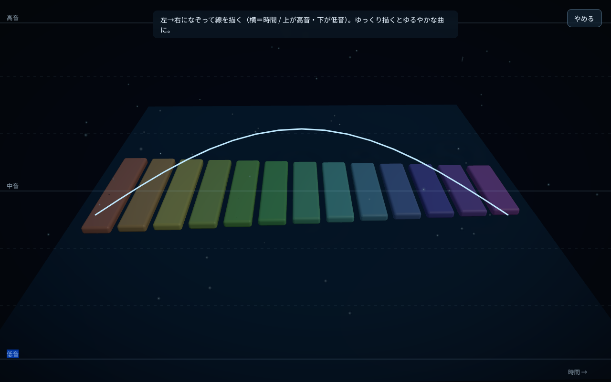

# ripple garden

宇宙×演奏×落書きのジェネラティブ・ミュージック箱庭。夜空を思わせる暗い宇宙空間に、ガラス／アクリルのようなペンタトニックの鉄琴バーが浮かぶ。高所から長い軌跡を引いて落ちる星がバーに当たると、その音が優しく鳴り、バーがほのかに発光する。音板（バー列）を中心に太陽・月・惑星（土星は環つき）が周回し、時おり流れ星が横切り、画面全体に光の粒子が漂う。色調補正と Vignette の後処理で落ち着いた夜の質感に整えている。音はブラウザの自動再生制限のため、最初の一度のクリックで解禁される。

そして主役は **「なぞって作曲」**。画面いっぱいに線を描くと、それがそのまま旋律になり、降る星が音を奏でる。



## 起動方法

操作の正典は `Makefile`。`make help` で全ターゲットを表示できる。

```bash
make run        # 開発サーバを起動（0.0.0.0 で外部公開・http://localhost:5173/）
make build      # 型チェック ＋ 本番ビルド
make typecheck  # 型チェックのみ
make preview    # ビルド結果をプレビュー
make smoke      # ヘッドレス WebGL でシェーダ/実行時エラー＋楽譜DLを検査
make clean      # ビルド成果物を削除
make stop       # 開発サーバを停止（PORT=NNNN で対象ポート指定）
```

`make ci` は `build` ＋ `smoke` の検証一式。各ターゲットは内部で npm スクリプト（`dev` / `build` / `typecheck` / `preview` / `smoke`）を呼んでいるので、`npm run <script>` も使えるが、通常は make 経由を推奨する。

ブラウザが開いたら、最初に一度どこかをクリックして音を解禁する（映像はクリック前から自動で動く）。左の設定メニュー（歯車）からミュート切り替えができる。

## できること

### なぞって作曲（主役）

- **画面全体の落書きキャンバス**：右の作曲メニューから「星を落書き」を開くと、画面いっぱいの作画オーバーレイになる。縦＝音の高さ（上が高音、下が低音）。横方向は時間（描いた順）。
- **複数ストロークの自由作画**：一筆書きに縛られず、何本でも線を描ける。別々のストローク＝跳躍（連続音階に縛られない）、横方向に大きく重なるストローク＝和音（同じ時間帯に重ねて鳴る）。
- **ペンタトニックへ量子化**：描いた縦位置は、現在の「音域」スライダーで決まるペンタトニック音域へ量子化される。跳躍も和音も不協和になりにくい。線は弧長で等間隔サンプリングするので、線が長いほど音数が増える。
- **複数レイヤーを同時ループ再生**：描いた旋律はレイヤーとして溜まり、有効なものが同時にループ再生される。各レイヤーごとに 有効/無効・削除・再編集・落下速度（個別テンポ）を調整できる。
- **ペン / 消しゴム**：作画中にペンと消しゴムを切り替えられる。消しゴムは近傍のストロークを丸ごと消す。「ひとつ戻す」「やめる」「落書き完了」のアクションつき。重ねがけ時は既存レイヤーの線が薄く表示される。
- **すべて表示**：全レイヤーを各色で重ねて一覧するオーバーレイ。線（または凡例）をタップすると、その落書きの再編集へジャンプする。
- **合奏の保存／読み込み**：レイヤー一式（合奏）を JSON でエクスポート／インポートできる（描いた軌跡・個別テンポ・有効状態も保存）。

### アンビエントに降る星

- **星の量スライダー**：ランダムに降るアンビエントな星の量。既定は中央（つまみ 50%）で、中央＝0（降らない）、右へ動かすほど増える。左半分は 0。
- これらの星もバーに当たると発音し、なぞって作曲のレイヤーと同時に流れる。

### 設定（場と星）

- **音域**：鳴る音域の幅。6〜17 音（ペンタトニックの高い方から指定本数）。バーの本数・色・配置が追従する。
- **落下速度**：場全体の速さを一括で支配する。星の落下・天体の周回に加え、なぞって作曲のマスターテンポも兼ねる（個別の速さは各レイヤーのテンポ）。
- **音量**：マスター音量。0 で無音。
- **配置**：一列／円形を切り替え（円形は的が密集して当たりやすい）。
- **星トグル**：星の再生／停止。OFF で全ての落下星が止まり、飛行中の星も消える。
- **ミュート**：音の即時オン／オフ。

### 楽譜の書き出し

- 鳴った音（バー命中）を時刻つきで記録し、設定メニューの楽譜DLボタンから五線譜（SVG）としてダウンロードできる。記譜は abcjs（ダウンロード時に動的読み込み）。8 分音符グリッドに量子化し、近接音は和音にまとめ、無音は休符にする。

### モバイル対応

スマートフォンでも崩れないレイアウト：`100dvh`（アドレスバーで下部UIが隠れる問題対策）、`env(safe-area-inset-*)` によるセーフエリア余白、操作ボタンは高さ 44px 以上のタッチ判定。PC では `env()` が 0・`100dvh` が `100vh` と等価のため、デスクトップの見た目は変わらない。非力な端末では解像度・粒子数・影・マルチサンプリングを自動で落とす。

## 技術スタック

- Vite + React + TypeScript
- React Three Fiber (`@react-three/fiber`) + `@react-three/drei`
- `@react-three/postprocessing`（色調補正 HueSaturation/BrightnessContrast ＋ Vignette。Bloom は多数同時発光で白飛びするため不採用）
- Tone.js（音。初回クリック時に動的読み込み。木琴は外部サンプルを使い、未読込時は合成音にフォールバック）
- abcjs（楽譜の五線譜生成。楽譜DL時に動的読み込み）
- lucide-react（UI アイコン）

## 構成

```
src/
  main.tsx               エントリ（React のマウント）
  App.tsx                ルート。初回クリックで音解禁、タブ非表示で音停止/復帰
  index.css              全体スタイル（モバイル safe-area / 100dvh / 44px タッチ対応）
  config.ts              シーン調整パラメータ＋バー生成・ペンタトニック音域・レイアウト関数
  util/quality.ts        端末判定と描画品質（dpr・粒子数・影・マルチサンプリング）
  scene/
    Scene.tsx            Canvas・カメラ・ライト・環境マップ・粒子・OrbitControls・後処理
    Effects.tsx          後処理（色調補正 ＋ Vignette）
    Celestial.tsx        音板を中心に周回する太陽・月・惑星（土星は環つき）と追従ライト
    RainSystem.tsx       星の生成・着地判定・バー命中での発音／発光／飛沫・レイヤー同時ループ再生の統括
    Drop.tsx             落ちる星 1 つ（発光する頭＋落下軸に伸びる光跡）
    Splash.tsx           バー命中時に弾ける光の飛沫
    ShootingStars.tsx    ランダムな間隔で夜空を流れる流れ星（長い軌跡つき）
    XylophoneBar.tsx     鉄琴バー 1 本（ガラス/アクリル質・命中で発光減衰）
  state/
    settings.ts          実行時設定（星の量・音域・落下速度・音量・配置）。レイアウト変更は購読可
    layers.ts            なぞって作曲のレイヤー管理（追加・有効/無効・削除・再編集・テンポ・インポート）
  score/
    drawMelody.ts        ストローク → 旋律変換（弧長サンプリング・跳躍/和音・テンポ計算）
    layerLines.ts        レイヤー → SVG 折れ線（描いた軌跡の再表示／音符列からの再構成）
    melodyIO.ts          合奏（レイヤー一式）の JSON エクスポート／インポート
    toAbc.ts             記録した音 → ABC 記譜への変換（量子化・和音・休符）
    downloadScore.ts     abcjs で五線譜 SVG を生成して保存
  audio/
    synth.ts             Tone.js 音響エンジン（遅延読み込み・木琴サンプル＋パッド・マスターチェーン）
    songs.ts             メロディの音符型（和音対応）と音名→MIDI ユーティリティ
    recorder.ts          鳴った音の記録（楽譜書き出し用・長さ制限つき）
```

## 既知の制約 / 今後

- スクリーンショットは最新のビジュアルより古い場合がある。
- オブジェクト（バー・天体）はコードで固定配置（設置 UI・種類追加は未実装）。
- 木琴は外部サンプル（tonejs-instruments）に依存し、オフライン時は合成音にフォールバックする。
- `config.ts` 等には旧・水面シミュレーション由来の定数（`WATER_LEVEL` など）が一部残っており、着地面の基準などに転用されている。
